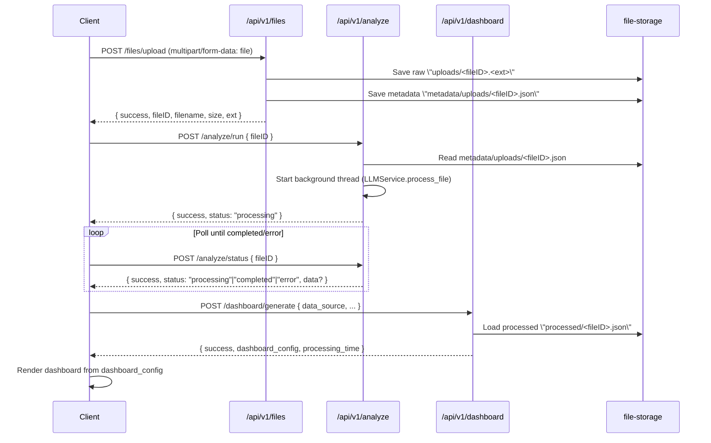

## Alternative Flow: Persisted Upload → Background Analysis → Dashboard Service

This document describes the alternative, asynchronous flow for generating dashboards from uploaded data. Unlike the synchronous `/api/v1/analytics/data` flow that processes files inline and returns results immediately, this flow persists the raw upload, processes it in the background, and then generates a typed `DashboardConfiguration` on the server.

### When to use this flow
- **Large/slow analyses**: Avoid long request blocks and timeouts.
- **Reproducibility & audit**: Persist raw uploads, metadata, and processed artifacts.
- **Regeneration**: Refresh dashboards later from stored processed data.

---

### Sequence overview (Mermaid)


---

### Endpoints and contracts

1) POST `/api/v1/files/upload`
- Purpose: Persist raw file and associated metadata.
- Request: multipart/form-data with `file`
- Response (example):
```json
{
  "success": true,
  "fileID": "025eabd8-f605-49a1-a08a-a24a3c9860f2",
  "filename": "sales.csv",
  "size": 1048576,
  "ext": "csv"
}
```
- Backend:
  - `backend/app/api/routes/files.py` → `upload_file`
  - Utilities: `backend/app/utils/file_handler.py`

2) POST `/api/v1/analyze/run`
- Purpose: Start background processing for a given `fileID`.
- Request:
```json
{ "fileID": "025eabd8-f605-49a1-a08a-a24a3c9860f2" }
```
- Response (example):
```json
{ "success": true, "fileID": "025eabd8-f605-49a1-a08a-a24a3c9860f2", "status": "processing", "message": "File processing started in background" }
```
- Backend:
  - `backend/app/api/routes/analyze.py` → `run_analysis`, `_process_file_background`
  - Processor: `backend/app/services/llm_service.py` (writes `processed/<fileID>.json`)

3) POST `/api/v1/analyze/status`
- Purpose: Poll processing status and fetch results/errors.
- Request:
```json
{ "fileID": "025eabd8-f605-49a1-a08a-a24a3c9860f2" }
```
- Response (processing):
```json
{ "success": true, "fileID": "025eabd8-f605-49a1-a08a-a24a3c9860f2", "status": "processing" }
```
- Response (completed - shape depends on `LLMService.process_file`):
```json
{ "success": true, "fileID": "025eabd8-f605-49a1-a08a-a24a3c9860f2", "status": "completed", "data": { /* processed summary */ } }
```
- Response (error):
```json
{ "success": false, "fileID": "025eabd8-f605-49a1-a08a-a24a3c9860f2", "status": "error", "error": "reason" }
```
- Backend:
  - `backend/app/api/routes/analyze.py` → `get_analysis_status`

4) POST `/api/v1/dashboard/generate`
- Purpose: Generate a typed `DashboardConfiguration` from the processed artifact.
- Request (example):
```json
{
  "data_source": "025eabd8-f605-49a1-a08a-a24a3c9860f2",
  "requirements": { "focus": ["revenue", "orders"] },
  "layout_preference": "GRID",
  "chart_types": ["LINE", "BAR", "PIE"],
  "metadata": { "title": "Sales Analytics" }
}
```
- Response (abridged example):
```json
{
  "success": true,
  "dashboard_config": {
    "id": "a1b2c3",
    "title": "Sales Analytics",
    "layout": { /* layout grid, positions */ },
    "components": [
      { "id": "metric_1", "type": "metric", "component_config": { "title": "Total Revenue", "value": 123456 } },
      { "id": "chart_1", "type": "chart", "component_config": { "type": "LINE", "title": "Revenue Over Time", "datasets": [/* ... */] } }
    ],
    "metadata": { /* passthrough metadata */ }
  },
  "processing_time": 1.23,
  "metadata": { "generated_at": 1712345678 }
}
```
- Backend:
  - `backend/app/api/routes/dashboard.py` → `generate_dashboard`
  - Service: `backend/app/services/dashboard_service.py` → `DashboardService.generate_dashboard_config`
  - Helpers: `backend/app/utils/chart_data_processor.py`
  - Types: `backend/app/models/dashboard_models.py`

---

### Storage layout and settings
- Raw uploads: `backend/file-storage/uploads/<fileID>.<ext>`
- Upload metadata: `backend/file-storage/metadata/uploads/<fileID>.json`
- Processed artifacts: `backend/file-storage/processed/<fileID>.json`
- Settings (paths): `backend/config/settings.py`
  - `FILE_UPLOADS_DIR`, `FILE_METADATA_UPLOADS_DIR`, `FILE_PROCESSED_DIR`

---

### Backend components involved
- File handling: `backend/app/utils/file_handler.py`
  - `validate_file`, `generate_file_id`, `get_upload_path`, `save_upload_metadata`, `get_upload_metadata`
- Background analysis: `backend/app/api/routes/analyze.py`
  - `run_analysis`, `get_analysis_status`, `_process_file_background`
  - Processor: `backend/app/services/llm_service.py`
- Dashboard generation: `backend/app/services/dashboard_service.py`
  - `generate_dashboard_config(...)` uses `ChartDataProcessor` and models in `backend/app/models/dashboard_models.py`
- API registration: `backend/app/api/main_routes.py` (registers `/files`, `/analyze`, `/dashboard` under `/api/v1`)

---

### Frontend integration outline
- Upload → `POST /api/v1/files/upload` (via your API client)
- Trigger → `POST /api/v1/analyze/run` with `{ fileID }`
- Poll → `POST /api/v1/analyze/status` until `status` is `completed` or `error`
- Generate → `POST /api/v1/dashboard/generate` with `data_source` set to the `fileID`
- Render → Use returned `dashboard_config` with existing chart components:
  - `frontend/src/services/dashboardService.ts`
  - `frontend/src/components/charts/ChartFactory.tsx`
  - `frontend/src/components/charts/ChartRenderer.tsx`

#### Rendering details (frontend)
- State and data flow
  - Invoke `dashboardService.generateDashboard(request)` and persist the returned `DashboardConfiguration` in app state (e.g., React state or a store).
  - Pass the configuration down to your dashboard page/container which iterates `dashboard_config.components` and renders per component `type`.

- Component mapping
  - `type: "metric"` → Render a metric/tile component using fields in `component_config` (e.g., `title`, `value`, optional `change`, `trend`).
  - `type: "chart"` → Use `ChartFactory`/`ChartRenderer` with `component_config` containing chart `type` (e.g., `LINE`, `BAR`, `PIE`), `title`, optional `description`, and `datasets`.
  - `type: "table"` → Render a table with `columns` and `rows` if provided by the configuration.

- Layout
  - Use the `layout` block in `dashboard_config` or the per-component `position` to place items on a grid. Typical fields include `x`, `y`, `width`, `height` for each component.

- Chart datasets (shape expectations)
  - Each dataset should include a label/series identifier and an array of points.
  - A common shape used by `ChartRenderer` is:
    - `datasets: [{ label: string, data: Array<{ x: string|number|Date, y: number }>, color?: string }]`
  - If categories are used instead of time, `x` can be category keys; for time series, ensure ISO date strings or timestamps consistently.

- Loading and error UI
  - While awaiting `generateDashboard`, show a loading skeleton for the dashboard grid.
  - If `success: false` or `dashboard_config` is missing, show a non-destructive error state with retry.

- Dynamic data refresh (optional)
  - For charts that support on-demand filtering or aggregation, call `/api/v1/dashboard/chart-data`.
  - Request example:
```json
{
  "chart_id": "chart_1",
  "filters": { "region": ["US", "EU"] },
  "aggregation": { "metric": "sum" },
  "time_range": { "from": "2024-01-01", "to": "2024-12-31" }
}
```
  - Response example (abridged):
```json
{
  "success": true,
  "data": {
    "datasets": [
      { "label": "Revenue", "data": [ { "x": "2024-01", "y": 12345 }, { "x": "2024-02", "y": 14567 } ] }
    ]
  },
  "metadata": { "requested_at": 1712345678 }
}
```
  - Update only the targeted chart’s `datasets` in local state to avoid rerendering the whole dashboard.

- Accessibility and formatting
  - Ensure numeric formatting (currency, percent) is applied consistently per metric.
  - Provide alt text/titles for charts and keyboard focus for interactive legend/filter elements.

- Caching and persistence
  - Optionally cache the last `dashboard_config` keyed by `dashboard_id` to speed up re-entry.
  - When the backend supports it, use `/dashboard/refresh` for periodic refresh without re-uploading.

---

### Polling strategy
- Interval: start at ~1–2s; consider exponential backoff up to ~10s.
- Timeout: cap total wait (e.g., 2–5 minutes) and surface a retry CTA.
- Stop conditions: `status === "completed"` or `status === "error"`.

---

### Error handling
- Upload: validation errors on size/type (`FileHandler.validate_file`).
- Analyze run: missing `fileID`, missing upload metadata, or missing raw file.
- Background: processing failure recorded as an error JSON in `processed/<fileID>.json`.
- Generate: `data_source` not found or malformed processed JSON → return error; client may retry run or re-upload.

---

### Security & retention notes
- Data-at-rest: Raw and processed data are persisted; apply appropriate access controls.
- Retention: Define TTL and cleanup for `uploads/`, `metadata/uploads/`, and `processed/`.
- PII: Ensure redaction/minimization pre-processing if necessary.

---

### Cross references (source)
- Backend
  - `backend/app/api/main_routes.py`
  - `backend/app/api/routes/files.py`
  - `backend/app/api/routes/analyze.py`
  - `backend/app/api/routes/dashboard.py`
  - `backend/app/services/llm_service.py`
  - `backend/app/services/dashboard_service.py`
  - `backend/app/utils/file_handler.py`
  - `backend/app/utils/chart_data_processor.py`
  - `backend/app/models/dashboard_models.py`
  - `backend/config/settings.py`
- Frontend
  - `frontend/src/services/dashboardService.ts`
  - `frontend/src/components/charts/ChartFactory.tsx`
  - `frontend/src/components/charts/ChartRenderer.tsx`

---

### Note on synchronous alternative (not used here)
- The synchronous path `POST /api/v1/analytics/data` (in `backend/app/api/main_routes.py` or `backend/app/api/routes.py`) processes the upload inline using `CSVProcessor` and returns analysis JSON directly. It does not persist uploads or processed artifacts and is better suited for small, fast analyses.


