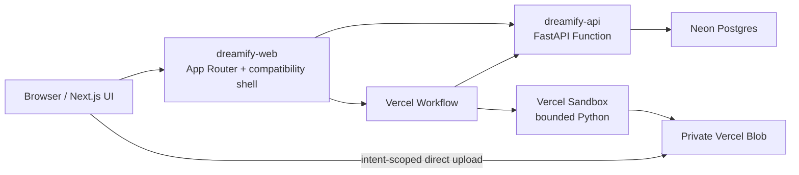

# Architecture

## Runtime boundaries

The browser renders the Next.js application, obtains short-lived authenticated Blob upload access, and uploads files directly to private Blob storage. FastAPI owns projects, owner/editor/viewer membership, assets, upload reservations, dashboards, conversations, capability policy, and the relational schema. Active membership is the project access boundary; creator/uploader IDs remain attribution fields. Workflow owns durable run orchestration and writes versioned run/events/results through explicit contracts. Generated Python executes only in an isolated Sandbox without application secrets or unrestricted network access.

Postgres stores users, project membership, object metadata, upload reservations,
conversation state, dashboard JSON and versions, workflow state/events/step
journals, provider-call reservations, and operator briefs. Blob stores uploaded
bytes and larger immutable workflow artifacts. Local development uses PostgreSQL
plus a filesystem object-store adapter.

## Deployment profile

`hobby_demo` is the only enabled profile initially. It is invitation-only, disables billing and external connectors by default, and enforces hard storage/workflow quotas before platform quotas are exhausted. A deterministic provider makes the full file-to-dashboard journey testable without model credentials.

## Compatibility strategy

The migrated frontend preserves current URL and visual behavior through Next.js App Router. Core browser-facing `/api/v1` contracts remain stable where practical. New contracts use run IDs, immutable storage references, typed capability responses, idempotency keys, and resumable event sequences.

The App Router owns routing, redirects, 404 behavior, static path generation,
metadata, sitemap, robots policy, Blob handlers, and Workflow entrypoints. The
native blog index/detail routes render and sanitize content on the server. The
remaining imported React UI currently runs inside one client-only compatibility
boundary; it is not yet decomposed page-by-page into React Server Components.
This keeps the visual migration reviewable while leaving broader
server-component optimization as an explicit follow-up.
